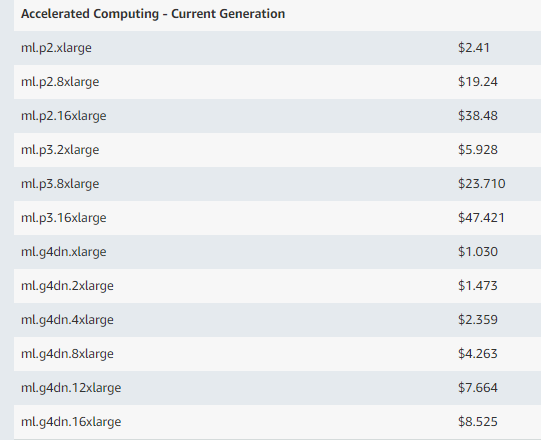

# Sagemaker

Amazon SageMaker is a fully managed service that provides every developer and data scientist with the ability to build, train, and deploy machine learning (ML) models quickly

## Machine Learning Model Training

1. Local Machine
2. Cloud Virtual Machine - EC2
3. Sagemaker

### Local Machine

```diff
+ Local machines are the obvious choice if enough power like memory, cpu and gpu are available.

- Due to increasing complexity of data manipulations and model training needed for Machine Learning projects it is very hard to always keep up to speed with the new technologies to tackle most of the projects using the local computers
```

---

### Virtual Machine

```diff
+ Virtual machines are a good substitue for local machines in ML developments. In this case user is able to rent and customize the server from the cloud providers.

Drawbacks:
- Installing all the required libraries
- incuring cost on
-    during the ML processing
-    during the ML preprocessing
-    forgetting to stop or terminate instances
- Terminating or stopping the instance loses the data.
- For more information google the Instance Store vs EBS
```



[Amazon Pricing](https://aws.amazon.com/sagemaker/pricing/)

---

### Sagemaker

```diff
+ Sagemaker has the advantage of being highly customized not only in selecting hardware during the training but also providing ML libraries out of the box.

+ In Sagemaker user doesn't need to install any libraries in most of the time.

+ User also has the potential of coding and preprocessing data on a reasonable cheap machine but train the model on a decent computer.

+ User is only billed during the training and as soon as model is finished with training, it will be automatically terminated.

+ Stopping the service doesn't remove the downloaded data
```

### Models with Amazon SageMaker

#### 1. Use a built in algorithm

- PCA
- XGBoost
- Semantic Segmentation
- ...  
  [Built-in Algorithms](https://docs.aws.amazon.com/sagemaker/latest/dg/sagemaker-algo-docker-registry-paths.html)

#### 2. Use prebuilt container images

- supply the Python code that implements your algorithm and configure the pre-built image to access your code as an entry point  
  [SageMaker Python SDK](https://sagemaker.readthedocs.io/en/stable/)

- Prebuilt Amazon SageMaker Docker Images for TensorFlow, MXNet, Chainer, and PyTorch.  
  [Prebuilt Docker Images](https://docs.aws.amazon.com/sagemaker/latest/dg/pre-built-containers-frameworks-deep-learning.html)

#### 3. Extend a pre-built container image

[Extend a pre-built container image](https://github.com/awslabs/amazon-sagemaker-examples/blob/master/advanced_functionality/pytorch_extending_our_containers/pytorch_extending_our_containers.ipynb)

#### 4. Build your own custom container image

    If there is no pre-built Amazon SageMaker container image that you can use or modify for an advanced scenario, you can package your own script or algorithm to use with Amazon SageMaker.You can use any programming language or framework to develop your container

## Estimators

It is a high level interface for SageMaker training

```python
from sagemaker.estimator import Estimator
hyperparameters = {

                        'batch_size': 16,
                        'lr': 0.01,
                        'lr_step': 10,
                        'data_location':training_path,
                        'epochs':5,
                        'mean': [0.485, 0.456, 0.406],
                        'std':[0.229, 0.224, 0.225],
                        'no_of_classes':2,
                        'model_def':'resnet50'
                    }


estimator = Estimator(role=role,
                      image_name=ecr_image,
                      base_job_name='docker-resnet50-cat-dog',
                      output_path=outputpath,
                      train_instance_count=1,
                      train_instance_type='ml.p3.2xlarge',
                      train_max_run=(5*24*60*60),
                      train_volume_size=20,
                      hyperparameters=hyperparameters)

estimator.fit({'training': training_path})
```
